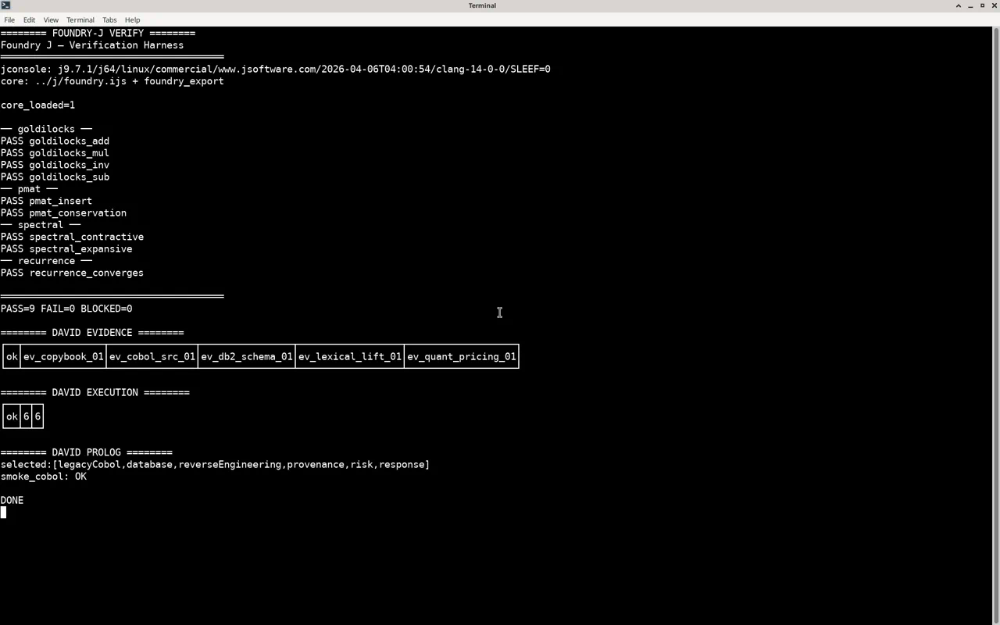

# Synthetic David (SMoA)

Sparse Mixture of Agents router: embeddings propose candidates; symbols decide eligibility. Product stack is **J + PostgreSQL/pgvector + Prolog**. Python under `evidence/`, `execution/`, and `router/*.py` is a **smoke harness only** — not the product.

## Idea

- Embeddings answer “who looks capable?”
- Executable Prolog (`router/symbolic_rules.pl`) plus the J eligibility caller (`j/eligibility.ijs`) answer “who is permitted and sufficient?”
- Similarity is never the authority; only the minimum justified agent set executes.

## Product vs harness

| Layer | Role |
|-------|------|
| `j/` | **Product** — scorer, execution, evidence retrieve (`scorer.ijs`, `execution.ijs`, `evidence.ijs`) |
| `sql/` | **Product** — AGENT / EVIDENCE indexes and hybrid retrieve SQL (for PostgreSQL + pgvector) |
| `registry/` | **Product** — `AgentDescriptor` schema + seed descriptors |
| `router/symbolic_rules.pl` + `registry_facts.pl` | **Product** — symbolic eligibility (SWI-Prolog); facts generated from seed YAML |
| `j/eligibility.ijs` | **Product** — J → Prolog eligibility caller (candidates + request → minimum set) |
| `docs/` | Contracts (WorkItem / AgentResult / Evidence) |
| `logs/` | Measured smoke outputs |
| `evidence/*.py`, `execution/*.py`, `router/*.py` | **Harness only** — do not grow as the product |

SQL is shipped as product schema/query text. J/Prolog smokes below are harness-local; live PostgreSQL/pgvector AGENT and EVIDENCE smokes are recorded under **Live AGENT-index smoke** and **Live EVIDENCE-index smoke** (hashed bag-of-tokens embeddings for smoke only).

## Layout

```text
j/                 J product (scorer, execution, evidence, smokes)
sql/               PostgreSQL/pgvector indexes + hybrid retrieve
registry/          agent descriptor schema + seeds
router/
  symbolic_rules.pl   product Prolog eligibility rules
  registry_facts.pl   generated agent facts (from seed_agents.yaml)
  *.py                Python smoke harness
j/eligibility.ijs     product J → Prolog eligibility caller
scripts/gen_registry_facts.py / check_prolog_registry_sync.sh   harness sync
evidence/          Python smoke harness (J evidence.ijs is product)
execution/         Python smoke harness (J execution.ijs is product)
docs/              contracts + screenshot placeholders
logs/              measured smoke logs
LICENSE            AGPL-3.0-only
```

## Measured smoke results

Facts only (no invented Postgres timings or live DB claims):

**Evidence smoke (J)** — `ok`; top ids  
`ev_copybook_01`, `ev_cobol_src_01`, `ev_db2_schema_01`, `ev_lexical_lift_01`, `ev_quant_pricing_01`  
(quant is present in the top set but not #1).  
Log: `logs/j_evidence_smoke.log`

**Execution smoke (J)** — `ok` ; `6` ; `6`  
Log: `logs/j_execution_smoke.log`

**Prolog smoke (`smoke_cobol`)** —  
`selected:[legacyCobol,database,reverseEngineering,provenance,risk,response]`  
`smoke_cobol: OK`  
Log: `logs/prolog_smoke_cobol.log`

**Prolog↔registry sync** — `prolog_registry_sync: OK` (10 agents; Quant present as negative)  
Log: `logs/prolog_registry_sync.log`

**J→Prolog eligibility smoke** — candidates ANN fixture + Quant; selected  
`legacyCobol, database, reverseEngineering, provenance, risk, response` (Quant absent)  
`eligibility_smoke: OK`  
Log: `logs/prolog_eligibility_smoke.log`

## How to run smokes

Requires J `jconsole` and (for Prolog) SWI-Prolog.

```bash
# J evidence
jconsole j/run_evidence_smoke.ijs

# J execution
jconsole j/run_execution_smoke.ijs

# Prolog COBOL eligibility smoke (see router/symbolic_rules.pl)
swipl -q -s router/symbolic_rules.pl -g smoke_cobol -t halt

# Prolog↔registry sync (harness; fails if registry_facts.pl dirty)
./scripts/check_prolog_registry_sync.sh

# J → Prolog product eligibility smoke (must exit; uses fixtures/ann_topk.txt)
cd j && /home/box/j/j9.7/bin/jconsole run_eligibility_smoke.ijs
```

Spec product path is **Prolog + J eligibility caller** (`j/eligibility.ijs` → `swipl`). Python harness tests are optional and are not the product path.

## Demo screenshots

Screenshots land under `docs/images/`:





*(Primary capture is `david-demos.png`; the evidence/execution/prolog names are aliases of the same shot for now.)*

## License

**AGPL-3.0-only** — see [`LICENSE`](LICENSE).

## Out of scope

- Alapeno hardware and Foundry F1 audit/linker/seals (see sibling [foundry-j](https://github.com/AHMADALIPARR/foundry-j) for pure-J math cores only)
- Growing the Python trees as the product surface
- Inventing PostgreSQL/pgvector timings or PASS lines without a real local run

## Live AGENT-index smoke

Measured on local PostgreSQL 17 + pgvector (hashed bag-of-tokens embeddings for smoke only):

- Loaded 10 agents from `registry/seed_agents.yaml` into `agent_registry`
- COBOL balance query ANN top-5: **LegacyCobol** (sim≈0.407), ReverseEngineering, MigrationValidation, Modernization, Response
- **Quant** absent from top-5 (`quant_not_preferred=True`)
- Log: `logs/agent_ann_smoke.log`
- Harness: `scripts/load_agent_registry.py`, `scripts/agent_ann_smoke.py`

## Live EVIDENCE-index smoke

Measured on local PostgreSQL 17 + pgvector (hashed bag-of-tokens embeddings for smoke only):

- Loaded 6 COBOL fixtures from `sql/003` IDs into `evidence` with embeddings filled by harness
- Hybrid retrieve (`sql/002`): dense + lexical + authority; `min_authority=0.5`; `require_parent=false`
- Top-5: **ev_cobol_src_01**, **ev_copybook_01**, ev_lexical_lift_01, **ev_db2_schema_01**, ev_quant_pricing_01
- copybook / cobol_src / db2 all rank above Quant; Quant not #1
- `ev_junk_low_auth` (authority 0.10) dropped by `min_authority=0.5`
- Log: `logs/evidence_hybrid_smoke.log` (`pass=True`)
- Harness: `scripts/load_evidence_seed.py`, `scripts/evidence_hybrid_smoke.py`
